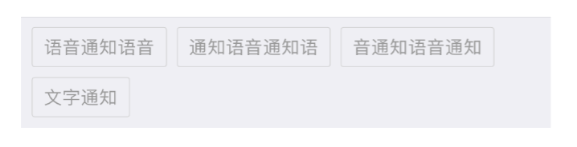
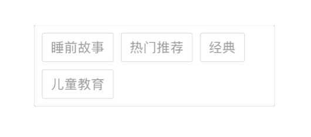

#一个多标签显示控件

用于以分词形式显示某个对象的多个标签，比如：




## 用法

将 TagsView.h/.m 文件拷贝到你的项目文件夹，在需要用到该控件的地方导入 TagsView.h 头文件。

在 ViewController 的 viewDidLoad 方法中，添加如下代码：

```swift
	// 1
	 _tagsView = [[TagsView alloc]initWithFrame:CGRectMake(10, 100, 300, 10)];
    
	_tagsView.showDebugBorder = YES;
    // 2
	_tagsView.tags=@[@"睡前故事",@"热门推荐",@"经典",@"儿童教育"];
    // 3
    [self.view addSubview:_tagsView];
```

1. 指定 frame 构造一个 TagsView。
2. 设置要显示的标签文本 tags，也就是一个简单的字符串数组，这会自动设置 TagsView 的高度以适应真实内容的大小。
3. 添加到 subview。

实际运行效果如下：



## 属性

TagsView 支持以下属性，你可以通过这些属性实现一定程度的定制：

1. tags：要显示的标签文本 tags，一个简单的字符串数组。
2. textColor：标签文本的颜色。
3. fontSize：标签文本的字体大小。
4. cornerRadius：每个 tag 的圆角。
5. borderColor：tag 包裹的边框颜色。
6. borderWidth：边框粗细。
7. textInsets：边框和文本之间的留白 Insets，只有 top、left 值有用。
8. borderInsets：边框与相邻边框之间的留白 Insets，只有 top、left 值有用。
9. intrinsicFrame：根据实际内容计算出来的框架大小，只读属性。
10. showDebugBorder：是否显示控件本身的边框。
11. title: 标题文字，如上图中的“标签”;
12. titleInsets: 标题四周的留白，只有 top 和 left 值有效。
13. titleColor: 标题文字的颜色。

### Demo

在 Xcode 8 中打开 TagsView.xcodeproj。

有任何问题和建议，请与[作者](kmyhy@126.com)联系。