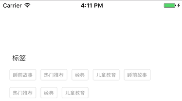

#一个多标签显示控件

用于以分词形式显示某个对象的多个标签，比如：


## 用法

将 TagsView.h/.m 文件拷贝到你的项目文件夹，在需要用到该控件的地方导入 TagsView.h 头文件。

### IB 中的工作

拖一个 UIView 到故事板中，设置 UIView 宽度，高度随意（高度会自动计算）。将 Class 改成 TagsView。你会看到故事板变成这个样子：



可能效果不是你想要的，没关系，我们会在运行时改变它。

然后用 Assistant 编辑器为这个控件创建一个 IBOutlet 连接：

	@property (weak, nonatomic) IBOutlet TagsView *tagsView;

### 在 ViewController 中

在 viewDidLoad 方法中，添加如下代码：

```swift
	// 1
	_tagsView.showDebugBorder = YES;
	// 2
	_tagsView.tags=@[@"睡前故事",@"热门推荐",@"经典",@"儿童教育"];
	// 3
   _tagsView.frame = _tagsView.intrinsicFrame;
```

1. 这会在控件周围显示一个边框，以便我们查看它的真实框架（即 intrinsicFrame）。
2. 设置要显示的标签文本 tags，也就是一个简单的字符串数组。
3. 让 tagsView 的框架和真实内容的大小相符（intrisincFrame）。

实际运行效果如下：


## 属性

TagsView 支持以下属性，你可以通过这些属性实现一定程度的定制：

1. tags：要显示的标签文本 tags，一个简单的字符串数组。
2. textColor：标签文本的颜色。
3. fontSize：标签文本的字体大小。
4. cornerRadius：每个 tag 的圆角。
5. borderColor：tag 包裹的边框颜色。
6. borderWidth：边框粗细。
7. textInsets：边框和文本之间的留白 Insets，只有 top、left 值有用。
8. borderInsets：边框与相邻边框之间的留白 Insets，只有 top、left 值有用。
9. intrinsicFrame：根据实际内容计算出来的框架大小，只读属性。
10. showDebugBorder：是否显示控件本身的边框。

### Demo

在 Xcode 8 中打开 TagsView.xcodeproj。

有任何问题和建议，请与[作者](kmyhy@126.com)联系。